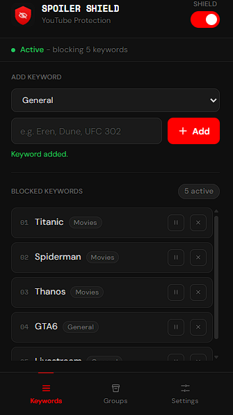
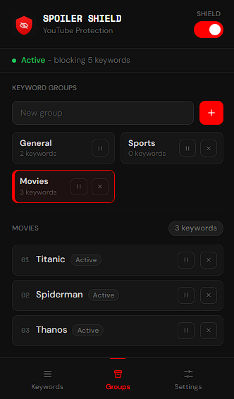
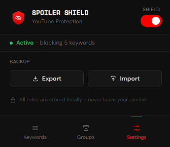
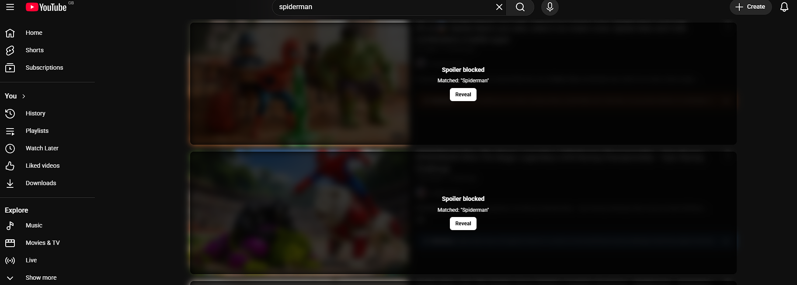
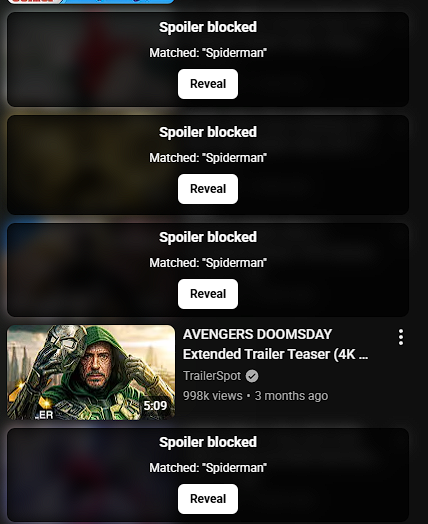

# YouTube Spoiler Shield

YouTube Spoiler Shield is a privacy-first Chrome extension that blurs YouTube videos, Shorts, search results, and recommendations when they match spoiler keywords you choose.

It is built for avoiding spoilers from anime, sports, movies, games, shows, events, and any other topic you want to temporarily hide.

## Screenshots

### Popup

| Keywords | Groups | Settings |
| --- | --- | --- |
|  |  |  |

### YouTube Blocking





## Features

- Blur YouTube videos that match your spoiler keywords.
- Works across YouTube home, search results, watch-page recommendations, sidebar videos, and Shorts surfaces.
- Detects dynamically loaded videos while scrolling.
- Matches punctuation and spacing variants, such as `Spider-Man`, `Spider Man`, and `Spiderman`.
- Add, remove, pause, and resume individual keywords.
- Organize keywords into groups such as Anime, Sports, Movies, or custom groups.
- Pause or resume whole keyword groups.
- Bulk select keywords and move them between groups.
- Reveal blocked videos manually when you choose.
- Import and export a local backup of your keywords and groups.
- Stores all settings locally in your browser.

## Privacy

YouTube Spoiler Shield does not collect, sell, transmit, or share your data.

Your spoiler keywords, groups, and extension settings are stored locally using Chrome extension storage. They do not leave your device.

The extension requests:

- `storage`: to save your keywords, groups, and settings locally.
- `https://www.youtube.com/*`: to detect and blur matching YouTube content.

No analytics, tracking, remote servers, or user accounts are used.

## Installation For Local Testing

1. Install dependencies:

   ```bash
   npm install
   ```

2. Build the extension:

   ```bash
   npm run build
   ```

3. Open Chrome and go to:

   ```text
   chrome://extensions
   ```

4. Turn on **Developer mode**.

5. Click **Load unpacked**.

6. Select the project folder.

7. Open or refresh YouTube.

## Usage

1. Click the YouTube Spoiler Shield extension icon.
2. Add spoiler keywords.
3. Choose a group for each keyword if needed.
4. Keep protection enabled.
5. Browse YouTube normally.

Matching videos will be blurred with a spoiler overlay. You can reveal a blocked video manually if you want to view it.

## Keyword Groups

Keyword groups help organize different spoiler topics.

Examples:

- Anime
- Sports
- Movies
- Games
- TV Shows

Groups can be paused or resumed without deleting their keywords.

## Backup And Restore

Use the Settings page in the extension popup to export or import your local settings.

This is useful before reinstalling Chrome, switching devices, or backing up a spoiler list.

## Development

Build the extension:

```bash
npm run build
```

Run tests:

```bash
npm run test
```

Watch TypeScript changes:

```bash
npm run watch
```

## Current Status

This project is an MVP Chrome extension.

It focuses on reliable local spoiler blocking for YouTube with no tracking, no accounts, and no remote services.

## Disclaimer

YouTube Spoiler Shield is not affiliated with, endorsed by, sponsored by, or associated with YouTube or Google.
